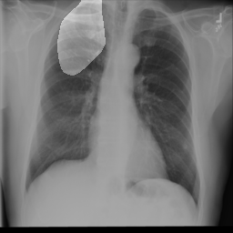

# SegX: Improving Interpretability of Clinical Image Diagnosis with Segmentation-based Enhancement

## Introduction
 

SegX [[paper](https://arxiv.org/abs/2502.10296)] is a plug-and-play approach designed to enhance the interpretability of deep learning-based medical image analysis by aligning explanation maps with clinically relevant regions using segmentation models. 

The SegX begins with the classification and XAI pipeline (green), where a medical image is processed by a classification model to generate predictions and an XAI method produces the original explanation map. Afterwards, the segmentation-based enhancement (blue) starts with a segmentation model that generates a clinical interests mask to align the XAI outputs with clinically significant regions using the SegX module, producing a refined SegX map.

Here is an example demonstrating how SegX enhances the interpretability of GradCAM on the ChestX-Det10 dataset.

<table>
  <tr>
    <td style="text-align: center;">
      
      <p style="margin-top: 5px; font-size: 14px;">(a) Raw Image</p>
    </td>
    <td style="text-align: center;">
      
      <p style="margin-top: 5px; font-size: 14px;">(b) GradCAM</p>
    </td>
    <td style="text-align: center;">
      
      <p style="margin-top: 5px; font-size: 14px;">(c) SegX-GradCAM</p>
    </td>
  </tr>
</table>


## Getting Started

### Prerequisites

List all the prerequisites needed to run the project. This could include software, libraries, and any setup required.

- Python 3.10+
- PyTorch
- Optuna (for hyperparameter search)


### Installation
Steps to install the project. This usually involves cloning the repository and installing dependencies.

```bash
git clone <https://github.com/JasonZuu/SegX.git>
cd SegX
pip install -r requirements.txt
```

### Download the Data and Model Weights (Optional)
You can download the required data and model weights using the following Kaggle links:
+ [Data](https://www.kaggle.com/datasets/mingchengzhu/segx-used-datasets)
+ [Model Weights](https://www.kaggle.com/datasets/mingchengzhu/segx-model-weights)

After downloading, place the files in the SegX directory and unzip `images.zip` and `masks.zip` for each dataset.

### Start with SegX-GradCAM (Optinal)
If you have downloaded the Data and Model weights and put them in the working directory, you should be able to interpret your model with the SegX using

```bash
python interpret.py --dataset ham --model resnet --algo segx_gradcam
python interpret.py --dataset chestx --model resnet --algo segx_gradcam
```

## Usage

### Grid Search for The Best Hyperparameters (Optional)
We provide the best hyperparameters and the grid search process in the `optuna_db` directory. However, you are free to modify the hyperparameter search space and rerun the grid search. To adjust the search space, edit [`configs/grid_search_configs.py`](configs/grid_search_configs.py) and update the relevant settings. Then, run

```bash
python grid_search.py --dataset ham --task cls --model resnet --pretrained
python grid_search.py --dataset ham --task cls --model densenet --pretrained
python grid_search.py --dataset ham --task seg --model unet --pretrained

python grid_search.py --dataset chestx --task cls --model resnet --pretrained
python grid_search.py --dataset chestx --task cls --model densenet --pretrained
python grid_search.py --dataset chestx --task seg --model unet --pretrained
```

For time constraints, we have not explored the impact of the segmentation model's performance on SegX's interpretability effectiveness, though we believe there is a positive correlation. If you are interested in investigating this relationship, feel free to experiment with different segmentation techniques using our framework. We are proud to support your research and contribute to the community.

### Train Your Model
After obtaining the best hyperparameters (or using our provided hyperparameters in [`optuna_db`](optuna_db), you can train your classification model with ResNet and DenseNet backbones and your segmentation model with the U-Net backbone using:

```bash
python train.py --dataset ham --model resnet --task cls --pretrained --use_best_hparams
python train.py --dataset ham --model densenet --task cls --pretrained --use_best_hparams
python train.py --dataset ham --model unet --task seg --pretrained --use_best_hparams

python train.py --dataset chestx --model resnet --task cls --pretrained --use_best_hparams
python train.py --dataset chestx --model densenet --task cls --pretrained --use_best_hparams
python train.py --dataset chestx --model unet --task seg --pretrained --use_best_hparams
```

Please note that you should always use `--use_best_hparams` when training the model. The parameters in [`configs/train_configs.py`](configs/train_configs.py) are not our default settings and may lead to poor performance.

### Interpret with SegX
After training your model (or using the downloaded model weights), you can interpret the model for your task using SegX using:

```bash
python interpret.py --dataset ham --model resnet --algo segx_gradcam
python interpret.py --dataset ham --model densenet --algo segx_gradcam
python interpret.py --dataset chestx --model resnet --algo segx_gradcam
python interpret.py --dataset chestx --model densenet --algo segx_gradcam

python interpret.py --dataset ham --model resnet --algo segx_gradient_shap
python interpret.py --dataset ham --model densenet --algo segx_gradient_shap
python interpret.py --dataset chestx --model resnet --algo segx_gradient_shap
python interpret.py --dataset chestx --model densenet --algo segx_gradient_shap
```

The code in [`interpret.py`](interpret.py) provides demos on the datasets used in our experiments. You can always modify it to suit your own tasks and models.

## Contributing

Guidelines for contributing to the project.

1. Fork the repository
2. Create a new branch (`git checkout -b feature-foo`)
3. Commit your changes (`git commit -am 'Add new feature'`)
4. Push to the branch (`git push origin feature-foo`)
5. Create a new Pull Request


## Citation
If you use our work for you research, please cite it as follows:
```bibtex
@inproceedings{zhang2025segx,
  title={SegX: Improving Interpretability of Clinical Image Diagnosis with Segmentation-based Enhancement},
  author={Zhang, Yuhao and Zhu, Mingcheng and Luo, Zhiyao},
  booktitle={AAAI Bridge Program on AI for Medicine and Healthcare},
  pages={100--108},
  year={2025},
  organization={PMLR}
}
```

## Contact

Provide contact information for further queries or support.

- Email: yuhao_zhang@u.nus.edu
- GitHub: [Yuhao Zhang](https://github.com/haozizizizi)

